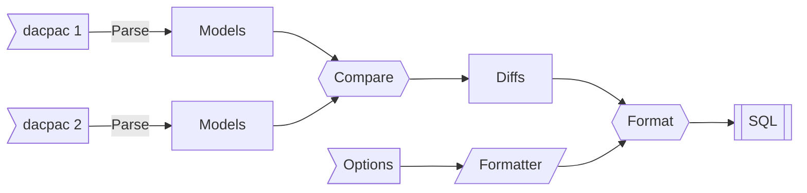

# Introduction
_dacpac-diff_ generates SQL diff files between the definitions of two dacpac files, to facilitate updating a database using easily managed scripts.

Normally, the correct way to do this is using the official `sqlpackage` tool, but this has a number of flaws/limitations:
* Obtuse/complex code - generated SQL does not work as a person would write it
* Non-deterministic output - processing the same dacpacs will produce different results
* Issues with some objects (e.g., system-named foreign keys)
* Little/no protection for running against wrong target
* Pretty slow

_Note:_ For clarity, this project reserves the word "schema" to refer to the database security concept and uses "scheme" when referring to the object definition of a database project.  
i.e., a dacpac represents a single _scheme_, which may affect multiple databases and schemas.

**Why use dacpac?**  
We work on a large platform that makes use of Visual Studio Database Projects for tracking our database schema source. This has a native output of dacpac, which provides an XML representation of the entire database schema that makes it really useful for comparing.

# Goals
* Fails safe - if a single part of the diff file fails, none of it applies
* Deterministic output - produce the same output when comparing the same two schemas
* Version protection of schema
* Extensible - not strongly tied to MSSQL

# Structure

# Limitations
* Only supports one database per scheme
* This only solves situations faced during use and is in no way considered to cover 100% of real-world scenarios
* The dacpac format is huge; we are only parsing it for the things of interest to us

# Planned functionality
* First-run, to set database version / produces "blank" dacpac
* Specify version of target dacpac, for projects that don't use our version structure
* Many more options
* Extensible model checks
* Extensible diff output
* Global nuget tool

# Long-term
* Extract minimal dacpac file from any database, to support non-MSSQL and other database projects
* Support non-MSSQL diff output
* Non-dacpac extract/import model of database

# Logical structure
1. Each dacpac is parsed in to an hierarchical set of models, representing the parts of the database we support
1. The full set of target and current models are compared for differences by "comparers" specific to the object type
1. The comparers produce a list of differences
1. The differences are ordered based on a number of factors, including dependencies
1. The differences are converted to the output format
